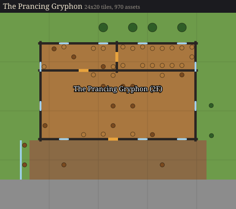
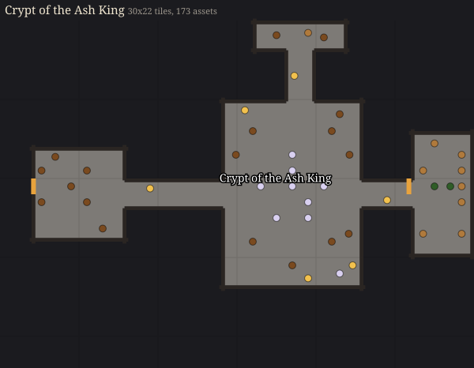
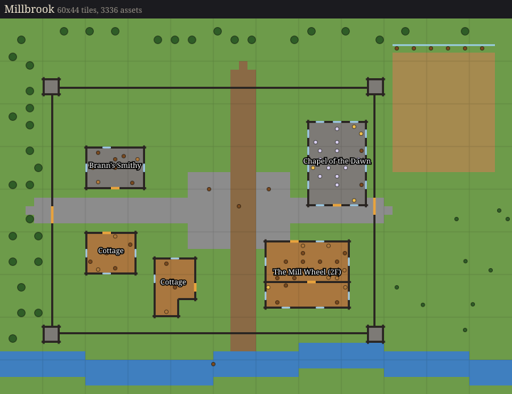
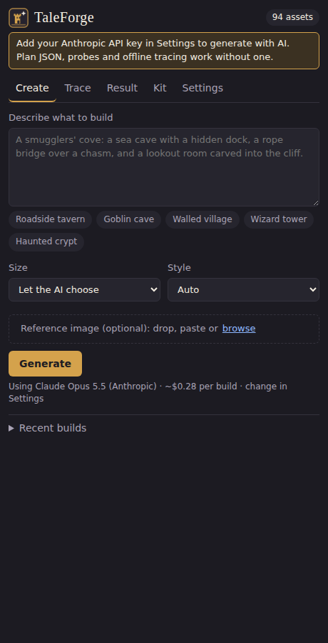
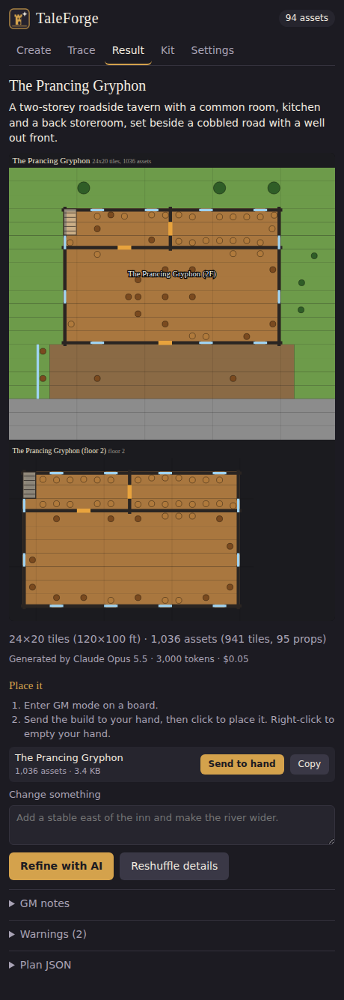
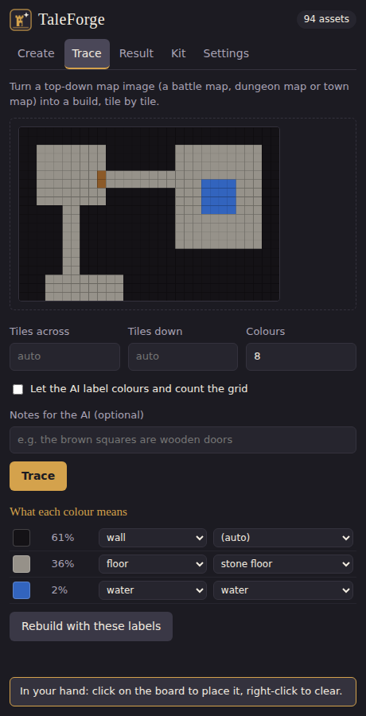
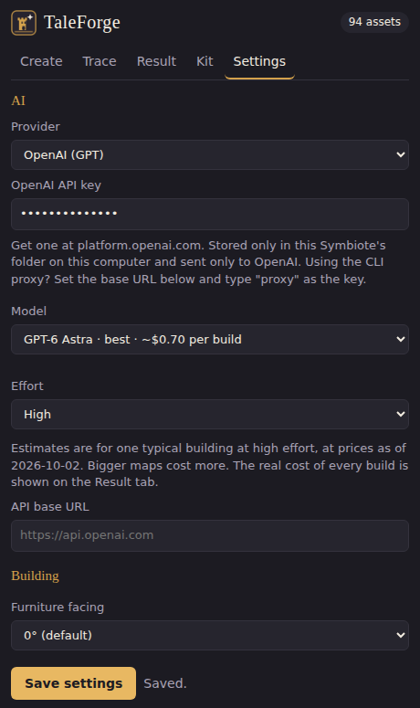

# TaleForge: AI board builder for TaleSpire

Describe a place, or show TaleForge a map, and it builds it in your [TaleSpire](https://talespire.com) board from **your own** tiles and props.

> *"A two-storey roadside tavern with a common room, kitchen and storeroom, a stable yard and a well, beside a cobbled road."*

<p align="center">
  
  
</p>
<p align="center"></p>

*Previews of the example plans in [`examples/plans`](examples/plans), built with the synthetic test catalog. Orange marks doors and blue marks windows; dots are props and furniture.*

TaleForge comes in two forms:

- **A Symbiote**, TaleSpire's official mod type: an in-game panel where you type, preview, and press *Send to hand*.
- **A command-line tool** that writes slab files you paste with `Ctrl+V`.

An AI model designs the layout: Claude (Anthropic) or GPT (OpenAI), whichever you have a key for. A deterministic builder turns it into correctly placed walls, floors, doors, roofs and furniture, using whatever content packs you have loaded.

<p align="center">
  
  
  
  
</p>

## What it can do

- **Generate from a description:** rooms, buildings, dungeons, caves, villages and walled towns, with doors, windows, multi-storey buildings (each floor with its own shape, rooms and furniture: shifted, turned or overhanging), stairs, hip roofs, town walls with towers and gates, roads, rivers, forests and furnished rooms.
- **Use a reference image:** as mood (concept art, a photo) or as a layout to reproduce (a floor plan or sketch).
- **Trace a battle map:** convert a top-down map image into floors, walls, water and trees, tile by tile. The AI labels what each colour means and counts the battle grid.
- **Refine:** "add a stable east of the inn", "make the river wider". Or edit the plan JSON by hand and rebuild instantly.
- **Use your own assets:** no hardcoded GUIDs. It reads your loaded content packs and lets you override the asset used for any role.
- **Build with community slabs:** search TaleSpire's official slab repository on mod.io and assemble a scene from other players' finished builds. TaleForge checks each slab against your library, turns and places it, draws the roads and terrain around it, and credits the creators. See [community-slabs.md](docs/community-slabs.md).
- **Fantasy and sci-fi:** the fantasy styles build from TaleSpire's fantasy library, and the `modern`, `cyberpunk` and `scifi` styles from its Cyberpunk and Sci-Fi library. Any group in your library with its own walls (Hull, Concrete Building, Tavern…) can be a building's material.
- **Paste correctly:**
  - Builds over TaleSpire's 30 KB slab limit are split into parts that line up when placed on the same spot.
  - A multi-slab JSON is also written for LordAshes' MultiPasteSlabsPlugin.
  - Props never overlap (TaleSpire silently drops overlapping props).
- **Pick your AI and see the cost:** choose the provider and model in Settings. Each model shows an estimated cost per build, which switches to your own measured average once you've built with it. Every result shows what that build actually cost.

## Install the Symbiote

1. In TaleSpire, open Settings and enable **Symbiotes**.
2. Click **Open Symbiotes Directory** (in settings or the Symbiotes panel). This opens `%AppData%\..\LocalLow\BouncyRock Entertainment\TaleSpire\Symbiotes\`.
3. Copy this repository's [`symbiote/`](symbiote) folder in as `TaleForge`, so you have `…\Symbiotes\TaleForge\manifest.json`.
4. Open **TaleForge** in the Symbiotes panel. Under **Settings**:
   - Choose a **Provider**: Anthropic (Claude) with a key from [console.anthropic.com](https://console.anthropic.com/), or OpenAI (GPT) with a key from [platform.openai.com](https://platform.openai.com/api-keys).
   - Paste your **API key**. It is stored only in the Symbiote's folder and sent only to that provider's API. You can save a key for each provider and switch between them.
   - Pick a **Model**. Each option shows an estimated cost per build.
   - Press **Save settings**.
5. Open a board in **GM mode**, describe something on **Create**, press **Generate**, then **Send to hand** and click to place.

Try **Settings > Probes** on a test board first. They place small builds that show whether walls, roofs and furniture orientation match your game; see [Known limitations](docs/architecture.md#known-limitations).

## Use the CLI

Requires Node.js 18 or later. There are no dependencies to install.

```bash
export ANTHROPIC_API_KEY=sk-ant-...   # or: export OPENAI_API_KEY=sk-...

# Compare models and their estimated cost per build
node src/cli/taleforge.js models

# Build from a description (reads your asset catalog from the TaleSpire install)
node src/cli/taleforge.js generate "a goblin warren in a hillside cave" --size compound --style cave \
    --talespire "C:/Program Files (x86)/Steam/steamapps/common/TaleSpire"

# Reproduce a floor plan or sketch
node src/cli/taleforge.js generate "the manor from this plan" --image manor.png --image-mode layout

# Assemble a scene from community slabs on mod.io (needs MODIO_API_KEY)
node src/cli/taleforge.js community "a harbour village with a tavern and a lighthouse"
node src/cli/taleforge.js modio search tavern

# Use a specific provider or model
node src/cli/taleforge.js generate "a lighthouse on a rocky islet" --provider openai --model gpt-6.1-sol

# Trace a battle map tile by tile (PNG), with the AI labelling the colours
node src/cli/taleforge.js trace dungeon-map.png --ai

# Edit an existing plan, or rebuild one with no AI at all
node src/cli/taleforge.js refine out/the-prancing-gryphon.plan.json "add a stable to the east"
node src/cli/taleforge.js build examples/plans/village.json

# See which asset fills each role, and look things up in your catalog
node src/cli/taleforge.js kit --style medieval
node src/cli/taleforge.js catalog search wine barrel --kind prop
```

Each build writes:

- `NAME.plan.json`, the plan
- `NAME.svg`, a preview
- `NAME.slab.txt`, or `NAME-part-NN.slab.txt` for split builds, to copy and paste with `Ctrl+V` in TaleSpire
- `NAME.multislab.slab` when split, for MultiPasteSlabsPlugin
- `NAME.report.md`, with GM notes, paste steps, warnings and the assets used

Commands that call the AI also print the tokens used and what the call cost.

The CLI uses whichever API key is set (Anthropic if both are), unless you pass `--provider`, or a `--model` whose name gives the provider away. The CLI finds your asset catalog from `--talespire DIR`, `TALESPIRE_PATH`, common Steam folders, or `--catalog file.json`. The Symbiote's **Kit > Copy catalog JSON** button exports one. `--demo` uses a synthetic catalog for previews only; it never writes slabs. Run `node src/cli/taleforge.js --help` for everything else.

## Learn more

- [Building with community slabs](docs/community-slabs.md): mod.io search, reading slabs, turning and placing them, credits and rules
- [How TaleForge works](docs/architecture.md): the plan format, compiler guarantees, trace mode, chunking, and how the Anthropic and OpenAI APIs are used
- [The TaleSpire modding guide](docs/talespire-modding-guide.md): Symbiotes, BepInEx and LordAshes' plugins, asset data, the URL scheme, community tools and gotchas
- [Slab format v2 and placement conventions](docs/slab-format.md): byte layout, how we verified it, and how pasting behaves

## Develop

```bash
npm test             # 90 unit tests, no dependencies
npm run test:e2e     # the Symbiote in Chromium with fake TaleSpire, Anthropic and OpenAI APIs (needs Playwright)
npm run test:live    # real API calls: needs ANTHROPIC_API_KEY or OPENAI_API_KEY, spends real money (capped, default $1.50)
npm run test:live -- --provider openai --model gpt-6.1-sol   # pick the provider and model
npm run bundle       # rebuild symbiote/taleforge.js after changing src/core
```

The Symbiote loads a bundle of `src/core`. Run `npm run bundle` after core changes; a test fails if the bundle is stale. To check the codec against real slabs copied from TaleSpire, put one slab per file in a folder and run `TALEFORGE_SLAB_FIXTURES=/path/to/folder npm test`.

## Credits

- Slab format: Bouncyrock's [DumbSlabStats](https://github.com/Bouncyrock/DumbSlabStats). Symbiote API: [symbiotes-docs](https://github.com/Bouncyrock/symbiotes-docs) and [examples](https://github.com/Bouncyrock/symbiotes-examples).
- Placement conventions measured in-game by [citysmith](https://github.com/jchallenger/citysmith) (Apache-2.0), whose findings TaleForge reproduces as tests.
- The idea of rewriting a 2D grid into TaleSpire walls comes from LordAshes' [TalespireDungeonMaker](https://github.com/LordAshes/TalespireDungeonMaker). The multi-slab format is from LordAshes' MultiPasteSlabsPlugin.

TaleForge is a community project, not affiliated with Bouncyrock Entertainment. TaleSpire is a trademark of Bouncyrock Entertainment.
