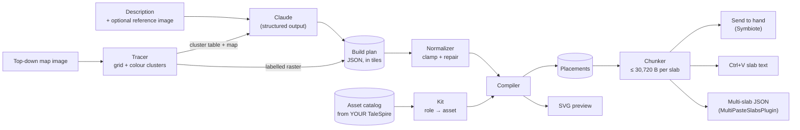

# How TaleForge works

## The design decision: Claude draws, code builds

Claude never writes asset IDs, world coordinates or slab bytes. It writes a **build plan**: a map drawn in tiles with semantic materials ("wood walls", "cobblestone") and roles ("bed", "anvil"). A deterministic compiler turns that plan into placements using the assets the GM actually owns. Splitting the work this way gives us:

- **Correctness where it's easy to get wrong.** Wall insets, rotation conventions, collider offsets, surface alignment and prop collisions are handled in tested code, not left to the model.
- **Robustness.** The plan is validated by a JSON schema (structured outputs) and then repaired by a normalizer. A bad rectangle gets clamped, a door on a missing wall gets snapped to the nearest real one, and an unreachable room gets a door added.
- **Portability.** The same plan builds with any asset packs. Asset GUIDs are only looked up at the last step, in the user's own catalog.
- **Editability.** The plan is short JSON. You can hand-edit it, keep it in version control, or refine it with Claude ("add a stable").

This mirrors what the citysmith project learned the hard way, but TaleForge lets Claude design the layout itself, not just pick parameters for a procedural generator. The compiler's guarantees are what make that safe.

## The build plan

Coordinates are in tiles (1 tile = 5 ft). (0, 0) is the top-left of the map; x grows east and y grows south, like an image. The full JSON schema is `PLAN_SCHEMA` in `src/core/plan.js`, and the instructions Claude sees are in `src/core/planner.js`.

| Field | Meaning |
|---|---|
| `width`, `height`, `style`, `ground` | Map size, look (`medieval`, `castle`, `dungeon`, `cave`, `ruins`, `desert`, `swamp`, `winter`, …), and the base surface (`none` for dungeons and interiors) |
| `areas[]` | Polygons painted over the ground in order: plazas, lakes, fields |
| `paths[]` | Polylines with a width: streets, trails, rivers |
| `structures[]` | Walled spaces: `parts` (union of rectangles), `rooms`, `doors` ({x, y, side}), `wall`/`floor` materials, `storeys`, `roof` (pitched/flat/none), `windows`, `interiorWalls`, `furnish` |
| `barriers[]` | Free-standing walls along grid lines: fortifications (towers, gates), palisades, fences, hedges |
| `props[]` | Placed objects: a `role` from a fixed vocabulary, plus an optional exact `asset` name from the GM's library |
| `scatter[]` | Polygons filled with natural clutter at a density: forests, rocks, graveyards |
| `title`, `summary`, `notes` | For the GM |

## The kit: roles → your assets

`src/core/kit.js` resolves each role, cached per build, in this order:

1. a **user override** (Kit tab or `--kit file.json`), as an exact name or GUID
2. **pinned names** known from the base game (`castle wall 1x1`, `Door -Peasant`, `Grass 1x1`, …)
3. **structured searches** (group tag, tags, name terms) with **shape constraints**
4. **material fallbacks** (`snow` → `grass`, `plaster` walls → `wood`)

The shape constraints:

- Surface roles must be exactly 1×1.
- Wall roles must be thin with length 1 (or 2 for long pieces), with windows matching the plain wall's height.
- Doors must be 1 long.
- Props have a per-role size cap, so a "rock" can't be a cliff face.

Big variants (`… 2x2`) are found by name and used to cover uniform 2×2 blocks, which roughly quarters the asset count on large floors. Surfaces that only exist as 2×2 blocks (tilled fields) fill blocks where they fit and use the fallback 1×1 at the edges.

The **Kit** tab shows every resolution with game thumbnails and the reason it was chosen (`pinned`, `search`, `override`, `missing`).

## The compiler

`src/core/compile.js` is deterministic: the same plan, kit and seed always produce the same slab. It runs in stages:

1. **Rasterize.** Ground → areas → paths → traced raster → structure footprints onto a tile grid. Later structures override earlier ones. Rooms subdivide structures; leftover cells form a hallway or main room.
2. **Edges.**
   - Every structure cell side that faces outside gets an exterior wall edge. With `interiorWalls`, sides between different rooms get partition edges.
   - Water or lava fully enclosed by one structure (a pool inside a hall) gets no walls.
3. **Doors.**
   - Planned doors are applied. A door that isn't on a wall snaps to the nearest wall edge, preferring the same side. In open-plan dungeons it stands freely in the opening.
   - A structure with no door gets one facing walkable ground, preferring roads.
   - A **reachability pass** adds doors on shared walls until every room connects to an entrance.
4. **Windows** go on exterior runs at a regular spacing, never at corners or beside doors.
5. **Emit.**
   - Surfaces are top-aligned, merging into 2×2 tiles where possible. Natural surfaces get random quarter rotations to break up tiling.
   - Walls are laid per storey along runs, using 2-long pieces where possible, with doors, windows and gates. Partitions appear only on the ground storey.
   - Upper floors and stairs are added (stairs prefer corners).
   - Roofs are flat, or **hip roofs by rings**: each course steps one cell in and one piece up, with outer corners, reflex corners and ridge caps.
   - Towers, keeps and castles get crenellations.
   - Barriers get towers at corners, two-wide gates and crenellated courses. Fences and hedges are laid as props along the line.
6. **Props**, highest priority first: the plan's explicit props (nudged in a small spiral if blocked), then **furniture** per room kind (wall-hugging items, center items, chairs around tables; `src/core/furnish.js`), then **scatter**.
   - A spatial hash prevents any two props from overlapping, since TaleSpire drops overlapping props on paste.
   - Walls and stairs are obstacles. Doorways (the cells on both sides of every door) stay clear.
7. **Normalize** by whole tiles, so floors stay on the grid minis snap to.

## Trace mode

`src/core/trace.js` reads a top-down map image:

1. Each grid cell's **dominant** colour is sampled, ignoring the cell's border so battle-grid lines don't dominate. An average would blur thin black walls into grey floor.
2. The colours are clustered with weighted **k-means++ in CIE Lab**, and tiny clusters are merged.
3. Clusters are labelled one of three ways:
   - **Claude**, which sees the image, a cluster table and a character map of the clusters. It also counts the battle grid and adds landmark props.
   - An **offline colour heuristic** (dark → wall in dungeons, blue → water, green → grass or forest, …).
   - **Hand-edited** labels in the Trace tab.
4. The result is a plan with a `raster`. Connected floor cells become one walled structure; door-class cells join their neighbouring structure as doors.

When Claude reports a grid size that differs from the first guess, the image is re-traced at that size. Labels carry across by nearest cluster colour, and prop positions are rescaled.

## Slabs, chunks and pasting

`src/core/chunk.js` measures the real compressed size and splits large builds by recursive bisection of the footprint, so each part is a contiguous region (you can paste a subset). For vanilla pasting, every part carries the same two registration tiles just outside opposite corners of the whole build, computed from real collider extents. That gives every part the same bounding box, so they line up when placed on the same cell. A second, unregistered cut is written as LordAshes' multi-slab JSON for one-keystroke pasting with BepInEx. See [slab-format.md](slab-format.md).

## Claude API usage

`src/core/claude.js` is a small streaming client over `fetch`. It uses raw HTTP rather than `@anthropic-ai/sdk` because the same file must run inside a Symbiote, which is a Chromium page loading local classic scripts with no npm or bundler. Each request:

- defaults to **`claude-opus-5-5`**; the Symbiote also offers Sonnet 5.5, Fable 5.1 and Haiku 4.5
- streams, since plans can be long
- uses **structured outputs** (`output_config.format` with the plan's JSON schema), so every response parses
- uses **adaptive thinking**, with `effort: high` by default; the Symbiote offers medium, high and extra high
- enables **server-side fallbacks** (`fallbacks: "default"`, beta `server-side-fallback-2026-07-01`). If the model declines, the API retries on its recommended fallback model, and any text streamed before the switch is discarded.
- marks the stable system prompt with `cache_control`, including the GM's prop-name list, so repeat generations are cheaper
- sends images no larger than 1568 px on the long side (resized client-side)
- from the Symbiote, adds `anthropic-dangerous-direct-browser-access: true` so the API allows the cross-origin call. The key stays on the user's machine.

Errors are mapped to plain messages: a bad key, rate limits, overload (retried), refusals, and `max_tokens` ("ask for a smaller area"). Haiku 4.5 requests omit thinking, effort and fallbacks, which it doesn't support.

Prefer not to store an API key in the Symbiote? Run `taleforge proxy`, which reads `ANTHROPIC_API_KEY` and listens on `127.0.0.1` with CORS. Then point the Symbiote's base URL at it and use `proxy` as the key.

## Testing

- `npm test`: 45 unit tests, covering:
  - the codec built by hand from the spec, and real game slabs byte-exact (opt-in fixtures)
  - geometry ground truth
  - kit resolution
  - compiler guarantees: walls, doors, reachability, open-plan dungeons, roofs, fortifications, no prop overlaps, floors on the grid, determinism
  - chunking and registration
  - the Claude client against recorded SSE streams: request shape, fallbacks, refusals, retries
  - tracing, the PNG codec, and the bundle
- `npm run test:e2e`: the real Symbiote in Chromium (Playwright) with a fake `TS` API and a fake Claude endpoint, from prompt to a decodable slab in the GM's hand, plus screenshots.

## Known limitations

- **Not yet run inside TaleSpire.** Everything was developed against the documented API and real slab data, but outside the game. Use the probes (Settings > Probes or `taleforge probe`) on a test board first. Please report what looks off.
- **Furniture facing** is a setting until someone confirms it in-game; see the facing probe.
- **No terrain height** yet: builds are flat ground with buildings, walls and roofs. Hills and cliffs are future work.
- **Upper storeys are shells:** solid floors with stairs, no rooms or furniture.
- **Roof kits** are recognised by name (Thatched, Village, Haunted). Other kits fall back to flat roofs.
- **Large towns** become several slabs and need careful same-cell pasting, unless you use the multi-paste plugin.
- **CORS from the Symbiote** relies on the API's browser-access header. If TaleSpire's web view blocks it, use the proxy.

## Module map

| File | Role |
|---|---|
| `src/core/slab.js` | Slab v2 codec, gzip/base64, normalization |
| `src/core/catalog.js` | Asset catalog from the Symbiote API, `index.json`, or JSON export; queries |
| `src/core/kit.js` | Roles, materials, styles → assets |
| `src/core/geometry.js` | Placement conventions (origin, rotation, edges) |
| `src/core/plan.js` | Plan schema + normalizer |
| `src/core/compile.js` | Plan → placements |
| `src/core/furnish.js` | Furniture rules per room kind |
| `src/core/chunk.js` | Slab splitting, registration, multi-slab JSON |
| `src/core/preview.js` | SVG preview |
| `src/core/build.js` | One call from plan to slabs, preview and report |
| `src/core/claude.js` | Messages API streaming client |
| `src/core/planner.js` | Prompts, plan generation, trace labelling |
| `src/core/trace.js` | Image → labelled raster |
| `src/core/png.js` | PNG decode/encode for the CLI |
| `src/core/probe.js` | Calibration builds |
| `src/core/demo-catalog.js` | Synthetic catalog for tests and previews (fake GUIDs) |
| `src/cli/taleforge.js` | Command line |
| `symbiote/` | The TaleSpire Symbiote (copy this folder into your Symbiotes directory) |
| `scripts/bundle.js` | Builds `symbiote/taleforge.js` from `src/core` |
